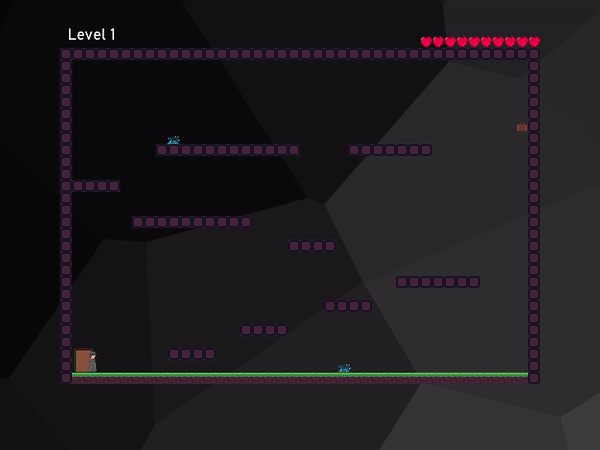

# LudumDare45
My game for Ludum Dare 45  (https://ldjam.com/)

# D.I. (Detective Inspector)

You are a detective tasked with finding evidence that will lead to the culprit of a heinous crime against humanity. The evidence is scattered through 9 levels. 

Get the binaries here... 
https://github.com/mbreckon/LudumDare45/files/3694773/LudumDare45-DI.Game.zip

- Esc will exit the game at any point
- Ctrl+F goes full screen
- Space moves the non-gameplay screens faster

- Left + Right arrow keys to move
- Space to jump

I've seen one bug in the collision detection (of course, where else?) where it is possible to get stuck on the end of a platform but I've not seen it happen that much in play testing.

The jumping style in this is deliberate - in many platform games you can adjust your position and orientation in mid-air. I made the decision early on to not allow that to happen. It makes the game hard but you can get used to it.

This was my first Ludum Dare and I knew that scope creep is the enemy of getting something finished (finishing a whole game was my goal) so I deliberately kept the mechanic simple and the scale short. I think it has come out ok - it plays a little frustrating at times but I actually quite enjoyed playing it during testing and I haven't played games like this for a long time. 

I'd hoped to spend a bit more time getting animations in the graphics but that has fallen by the wayside. The same with sound and music unfortunately. Given my goal was to get a playable game out I'm pretty happy with how its come out - in all my years as a kid growing up trying to write games like this on my Amstrad CPC I never actually finished making one!

This is written in C# using MonoGame - graphics done in Asesprite and Paint.NET. All artwork original (as required by the compo). All code was written from scratch too. 
